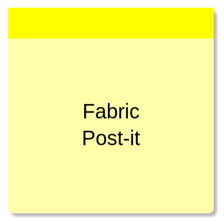

# fabric-postit
A Fabric.js post-it note extension.



## [Live Demo](https://av01d.github.io/fabric-postit/index.html)


## Table of contents
- [Features](#features)
- [Demo](#demo)
- [Installation](#installation)
- [Initialization](#initialization)
- [Properties](#properties)
- [Sub elements](#sub-elements)
- [Donations](#donations)
- [License](#license)

## Features
- Editable text
- Configurable colors, padding, text alignment etc.

## Demo

[Live demo](https://av01d.github.io/fabric-postit/index.html).

## Installation

Include the `fabric.postit.js` script file **after** `fabric.js`:

```html
...
<script src="js/fabric.js"></script>
<script src="js/fabric.postit.js"></script>
```

## Initialization

A note can be initialized with its initial text content and additional arguments:

```js
const note = new fabric.Postit('hello world', {
  width: 200,
  height: 200,
  top: 20,
  left: 20,
  fontFamily: 'Arial, Helvetica',
  noteColor: '#00ff4c',
  stripColor: '#00cc3d'
})
```

Properties can be altered like so:
```js
note.set('fontSize', 30)
note.set({noteColor: 'yellow', stripColor:'red'})
fabricCanvas.requestRenderAll()
````

## Properties

The following custom properties can be read and changed.

### text
- Type: `String`

The text to display on the Post-it Note.

### textPadding
- Type: `Number`
- Default: `10`

The padding between the box and text, in pixels.

### textAlign
- Type: `String`
- Default: `center`
- Options
  - `left`, `center`, `right`

The text alignment.

### fontFamily
- Type: `String`
- Default: `Sans-serif`

The font family.

### fontSize
- Type: `Number`
- Default: `20`

The font size.

### fontStyle
- Type: `String`
- Default: `normal`
- Options
  - `normal`, `italic`, `onblique`

### textColor
- Type: `String`
- Default: `#000`

The text color.

### noteColor
- Type: `String`
- Default: `#ffffaa`

The note's background color.

### boxShadow
- Type: `String`
- Default: `rgba(0,0,0,0.3) 3px 3px 3px`

Shadow behind the note, expressed as a CSS rule. Use `none` for no shadow.

### radius
- Type: `Number`
- Default: `5`

The border-radius of the bottom-left and bottom-right corners of the note.

### stripHeight
- Type: `Number`
- Default: `30`

The height of the sticky strip on top of the note, in pixels. Use `0` for no sticky strip.

### stripColor
- Type: `String`
- Default: `#ffff00`

The background color of the sticky strip.

## Sub-elements

The Postit is actually a group consisting of three elements, which can be accessed as properties:

- `Postit.tbox` → fabric.Textbox
- `Postit.note` → fabric.Rect
- `Postit.strip` → fabric.Rect

## Donations

If you like what I've made here, you can sponsor me with a donation. Thank you so much!

[](https://www.paypal.com/cgi-bin/webscr?cmd=_s-xclick&hosted_button_id=VUVAC8EA3X468)

## License

This plugin is released under the MIT license. It is simple and easy to understand and places almost no restrictions on what you can do with the code.
[More Information](http://en.wikipedia.org/wiki/MIT_License)

The development of this component was funded by [Zygomatic](https://www.zygomatic.nl/).
